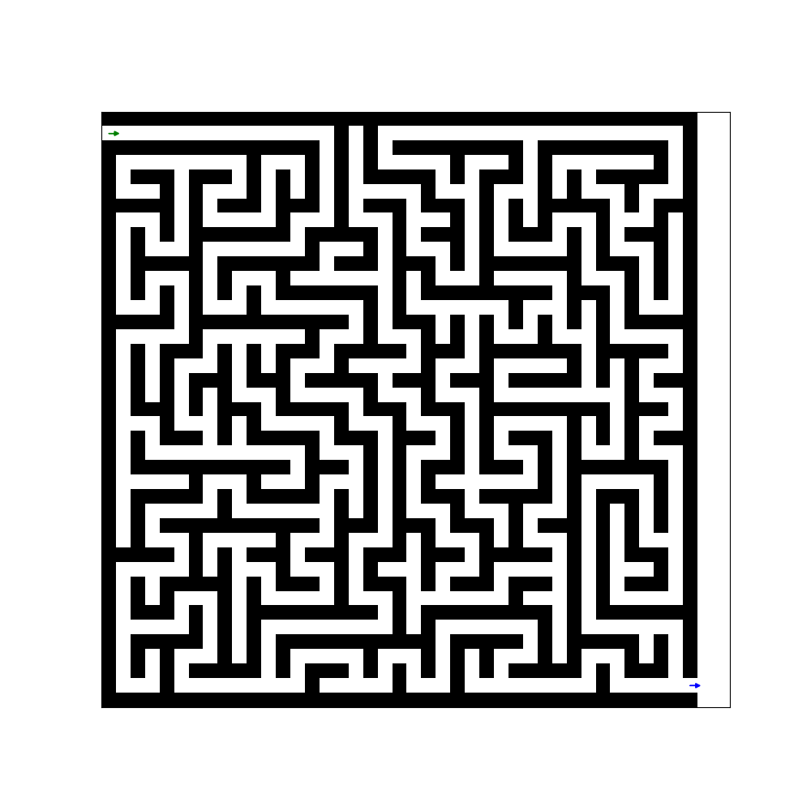

# Graph-Theory

### demo

迷宮動畫的算法演釋，由入口指向出口的順序。



### How to Run
```bash
git clone https://github.com/onon1101/Graph-Theory.git
cd Graph-Theory
pip install -r requirements.txt
python src/App.py
```
### 備註
這邊是我用來記錄每一次的安裝包

```bash
pip freeze > requirements.txt

conda env export > enviroment.yml
```

### 日記

    -   date: 12/04
        痾，今天利用了早餐時間想了一下這個專題可以些什麼。我想之後利用這個演算法，寫出BFS, DFS的算法，然後用兩個算法的結果，擬合出一個假的演算法，看看他們的結果為何，是否能在p問題與np問題中找到一個過渡的方法。

